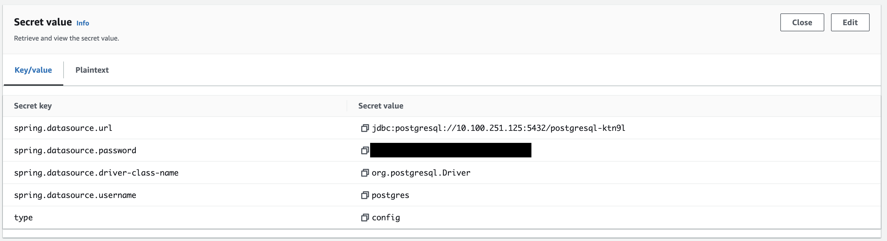

# Providing Runtime Configuration to Spring Boot Apps With Separation of Concerns in TAP

Samples that show different ways of providing runtime configuration to Spring Boot applications with separation of concerns and security in mind.

[Application Configuration Service](https://docs.vmware.com/en/Application-Configuration-Service-for-VMware-Tanzu/2.2/acs/GUID-overview.html) (ACS), which is part of TAP, is used in any sample for the developers to provide runtime configuration as it provides a good user experience by abstracting away Kubernetes. Spring Cloud Config Server is an open-source alternative to it.

## Prerequisites
- [ytt CLI installed](https://carvel.dev/ytt/)
- A TAP installation with version >=1.6
- [Bitnami Services](https://docs.vmware.com/en/VMware-Tanzu-Application-Platform/1.7/tap/bitnami-services-about.html) installed
- [Application Configuration Service](https://docs.vmware.com/en/VMware-Tanzu-Application-Platform/1.7/tap/application-configuration-service-install-app-config-service.html) installed
- Create a TAP developer namespace with the name "tap-app-config-properties": `kubectl apply -f namespace.yaml`
- Create a Bitnami PostgreSQL database instance `kubectl apply -f db-class-claim.yaml`
- Create a private repository for the ops configuration with e.g. the name "tap-app-config-properties-sample-ops-configuration"
- Copy the [values-example.yaml](values-example.yaml) file to a file with the name `values.yaml` and provide the correct configuration

## Sample 1: ACS for dev and ops
To make it as easy as possible, the configuration for the developers is [part of this public repository](externalized-dev-configuration/). 

Add the following two files to the main branch of your private repository for the ops configuration, and fill out the placeholders. You can get the information for the placeholders from the Kubernetes Secret that is created for your ClassClaim, and don't forget to Base64 decode the values. `kubectl get secret -n tap-app-config-properties $(kubectl get classclaim postgresql -n tap-app-config-properties -o jsonpath='{.status.resourceRef.name}') -o yaml` 

`Filename: inclusion.yaml`
```
spring.datasource:
  driver-class-name: org.postgresql.Driver
  username: postgres
```

`Filename: inclusion-production.yaml`
```
spring:
  datasource:
    url: jdbc:postgresql://<postgres-host>:<postgres-port>/<postgres-database>
    password: <postgres-password>
```

All required resources for the setup are available in the [acs-separation](acs-separation) folder.
```
ytt -f acs-separation/ -f values.yaml | kubectl apply -f -
```

Get the url of the deployed application via `kubectl get kservice acs-seperation-wkld -o jsonpath='{.status.url}' -n tap-app-config-properties`
If everything works, you should see "powered by POSTGRESQL" in the header, and multiple faces.

You can also go the App Live View, and have a look at the configuration properties with by selecting "env" from the dropdown.

## Sample 2: ACS for dev and ops with encrypted secret

There are two risks if secrets are not encrypted in GIT repositories, even if the access is restricted to those people who are allowed to see them. First, by cloning the repository to a local computer, those secrets are unencrypted on the local disk (which can for sure also be configured with encryption). The second one is that GIT has a history, and removing things from the history cannot be done with one simple command.

But, it's possible to encrypt sensitive information, like in our case e.g. the password of the database user. [ACS supports decryption](https://docs.vmware.com/en/Application-Configuration-Service-for-VMware-Tanzu/2.2/acs/GUID-gettingstarted-configuringconfigsources.html#referencing-credentials-and-keys). More information is also available in the [Spring Cloud Config docs](https://docs.spring.io/spring-cloud-config/docs/current/reference/html/#_encryption_and_decryption). 

Encrypted properties in the GIT repository have to be prefixed with `{cipher}`.

Create a new branch with the name `encrypted` based on the main branch.
To encrypt the database user's password, I used the 2.X version of the Spring Boot CLI. The 3.X version don't support the Spring Cloud CLI anymore. 
```
sdk install springboot 2.7.18
spring install org.springframework.cloud:spring-cloud-cli:2.2.4.RELEASE
spring encrypt <postgresql-password> --key <my-key>
```
The <my-key> value is the one you've specified in the values-example.yaml. We are using symmetric encryption but asymmetric encryption is also supported and more secure.

Update the password in the inclusion-production.yaml file in the encrypted branch.

All required resources for the setup are available in the [acs-separation-encrypted](acs-separation-encrypted) folder.
```
ytt -f acs-separation-encrypted/ -f values.yaml | kubectl apply -f -
```

Get the url of the deployed application via `kubectl get kservice acs-separation-encrypted-wkld -o jsonpath='{.status.url}' -n tap-app-config-properties`
If everything works, you should see "powered by POSTGRESQL" in the header, and multiple faces.

You can also go the App Live View, and have a look at the configuration properties with by selecting "env" from the dropdown.

## Sample 3: ACS for dev and External Secret Operator for ops

Operators usually already have a tool to manage secrets like for example Vault. The [External Secret Operator](https://external-secrets.io/latest/), which can be also [installed with TAP](https://docs.vmware.com/en/VMware-Tanzu-Application-Platform/1.7/tap/external-secrets-about-external-secrets-operator.html), provides capabilities to create Kubernetes Secrets based on them. 

So instead of defining the configuration properties in GIT, they can use one of the [supported secret management solutions](https://external-secrets.io/latest/provider/aws-secrets-manager/). This example is using AWS Secrets Manager, but you can easily change the SecretStore resource to e.g. the "Fake" provider.

Here a screenshot of how the configuration properties are defined in AWS Secrets Manager. 

Important is also the "type: config" configuration so the application is able to load it as configuration properties.

All required resources for the setup are available in the [external-secret](external-secret) folder.
```
ytt -f external-secret/ -f values.yaml | kubectl apply -f -
```

Get the url of the deployed application via `kubectl get kservice external-secret-wkld -o jsonpath='{.status.url}' -n tap-app-config-properties`
If everything works, you should see "powered by POSTGRESQL" in the header, and multiple faces.

You can also go the App Live View, and have a look at the configuration properties with by selecting "env" from the dropdown.

## Sample 4: ACS for dev and use automatically created secrets via Crossplane

With Crossplane, it's possible to automatically create secrets that are compatible with the ServiceBinding specification and [Spring Cloud Bindings](https://github.com/spring-cloud/spring-cloud-bindings) for e.g. data services that are running inside and also outside the Kubernetes cluster. This makes it effortless to provide configuration for e.g. data services in different environments.

All required resources for the setup are available in the [db-binding](db-binding) folder.
```
ytt -f db-binding/ -f values.yaml | kubectl apply -f -
```

Get the url of the deployed application via `kubectl get kservice db-binding-wkld -o jsonpath='{.status.url}' -n tap-app-config-properties`
If everything works, you should see "powered by POSTGRESQL" in the header, and multiple faces.

You can also go the App Live View, and have a look at the configuration properties with by selecting "env" from the dropdown.